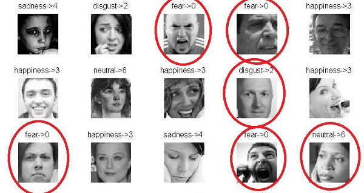
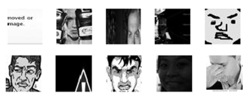

# Facial expression recognition using CNN in Tensorflow

Using a Convolutional Neural Network (CNN) to recognize facial expressions from images or video/camera stream.

## Table of contents

[1. Motivation](#motivation)

[2. Why is Fer2013 challenging?](#fer2013)

[3. Classification results](#results)

[4. How to use?](#how-to-use) 
- [Install the dependeciens](#install)
- [Download and prepare the data](#data)
- [Train the model](#train)
- [Optimize the hyperparameters](#optimize)
- [Evaluate a trained model](#evaluate)
- [Recognizing facial expressions from an image file](#recognize-image)
- [Recognizing facial expressions in real time from video/camera](#recognize-video)

[5. Contributing](#contrib)

<br />

# <a name="motivation">1. Motivation</a>

The goal is to get a quick baseline to compare if the CNN architecture performs better when it uses only the raw pixels of images for training, or if it's better to feed some extra information to the CNN (such as face landmarks or HOG features). The results show that the extra information helps the CNN to perform better.

To train the model, we used Fer2013 datset that contains 30,000 images of facial expressions grouped in seven categories: Angry, Disgust, Fear, Happy, Sad, Surprise and Neutral.

The faces are first detected using opencv, then we extract the face landmarks using dlib. We also extracted the HOG features and we input the raw image data with the face landmarks+hog into a convolutional neural network.

For our experiments, we used 2 CNN models:


# <a name="fer2013">2. Why is Fer2013 challenging?</a>

Fer2013 is a challenging dataset. The images are not aligned and some of them are uncorrectly labeled as we can see from the following images. Moreover, some samples do not contain faces. 





This makes the classification harder because the model have to generalize well and be robust to incorrect data. The best accuracy results obtained on this dataset, as far as I know, is 75.2% described in this paper: 
[[Facial Expression Recognition using Convolutional Neural Networks: State of the Art, Pramerdorfer & al. 2016]](https://arxiv.org/abs/1612.02903)


# <a name="results">3. Classification Results (training on 5 expressions)</a>

|       Experiments                            |    SVM    | Model A  |  Model B  |  Difference |
|----------------------------------------------|-----------|----------|-----------|-------------|
| CNN (on raw pixels)                          |   -----   |   72.4%  |   73.5%   |    +1.1%    |
| CNN + Face landmarks                         |   46.9%   |   **73.5%**  |   74.4%   |    +0.9%    |
| CNN + Face landmarks + HOG                   |   55.0%   |   68.7%  |   73.2%   |    +4.5%    |
| CNN + Face landmarks + HOG + sliding window  |   **59.4%**   |   71.4%  |   **75.1%**   |    +3.7%    |  

As expected:
- The CNN models gives better results than the SVM (You can find the code for the SVM implmentation in the following repository: [Facial Expressions Recognition using SVM](https://github.com/amineHorseman/facial-expression-recognition-svm))
- Combining more features such as Face Landmarks and HOG, improves *slightly* the accuray.
- Since the CNN Model B uses deep convolutions, it gives better results on all experiments (up to 4.5%).

It's interesting to note that using HOG features in the CNN Model A decreased the results compared to using only the RAW data. This may be caused by an overfitting or a failure to extract the coorelation between the information.

In the following table, we can see the effects of the batch normalization on improving the results:

|   Batch norm effects                         |  on Model A  |  on Model B  |
|----------------------------------------------|--------------|--------------|
| CNN (on raw pixels)                          |     +7.4%    |    +39.3%    |
| CNN + Face landmarks                         |    +26.2%    |    +50.0%    |
| CNN + Face landmarks + HOG                   |     +1.9%    |    +50.1%    |
| CNN + Face landmarks + HOG + sliding window  |    +16.7%    |    +16.9%    |

In the previous experiments, I used only 5 expressions for the training: Angry, Happy, Sad, Surprise and Neutral.

The accuracy using the best model trained on the whole dataset (7 emotions) dropped to 61.4%. 
The state of the art results obtained on this dataset, as far as I know, is 75.2% described in [this paper](https://arxiv.org/abs/1612.02903).


Note: the code was tested in python 2.7 and 3.6.

# <a name="how-to-use">4. HOW TO USE?</a>

## <a name="install">4.1. Install dependencies</a>

- Tensorflow
- Tflearn
- Numpy
- Argparse
- [optional] Hyperopt + pymongo + networkx
- [optional] dlib, imutils, opencv 3
- [optional] scipy, pandas, skimage

Better to use anaconda environemnt to easily install the dependencies (especially opencv and dlib)

## <a name="data">4.2. Download and prepare the data</a>

1. Download Fer2013 dataset and the Face Landmarks model

    - [Kaggle Fer2013 challenge](https://www.kaggle.com/c/challenges-in-representation-learning-facial-expression-recognition-challenge/data)
    - [Dlib Shape Predictor model](http://dlib.net/files/shape_predictor_68_face_landmarks.dat.bz2)

2. Unzip the downloaded files

    And put the files `fer2013.csv` and `shape_predictor_68_face_landmarks.dat` in the root folder of this package.

3. Convert the dataset to extract Face Landmarks and HOG Features
    ```
    python convert_fer2013_to_images_and_landmarks.py
    ```
    
    You can also use these optional arguments according to your needs:
    - `-j`, `--jpg` (yes|no): **save images as .jpg files (default=no)**
    - `-l`, `--landmarks` *(yes|no)*: **extract Dlib Face landmarks (default=yes)**
    - `-ho`, `--hog` (yes|no): **extract HOG features (default=yes)**
    - `-hw`, `--hog_windows` (yes|no): **extract HOG features using a sliding window (default=yes)**
    - `-hi`, `--hog_images` (yes|no): **extract HOG images (default=no)**
    - `-o`, `--onehot` (yes|no): **one hot encoding (default=yes)**
    - `-e`, `--expressions` (list of numbers): **choose the faciale expression you want to use: *0=Angry, 1=Disgust, 2=Fear, 3=Happy, 4=Sad, 5=Surprise, 6=Neutral* (default=0,1,2,3,4,5,6)**

    Examples:
    ```
    python convert_fer2013_to_images_and_landmarks.py
    python convert_fer2013_to_images_and_landmarks.py --landmarks=yes --hog=no --how_windows=no --jpg=no --expressions=1,4,6
    ```
    The script will create a folder with the data prepared and saved as numpy arrays.
    Make sure the `--onehot` argument set to `yes` (default value)

## <a name="train">4.3. Train the model</a>
1. Choose your parameters in 'parameters.py'

2. Launch training:

```
python train.py --train=yes
```

The variable `output_size` in parameters.py (line 20), should correspond to the number of facial expressions you want to train on. By default it is set to 7 expressions.

3. Train and evaluate:

```
python train.py --train=yes --evaluate=yes
```

N.B: make sure the parameter "save_model" (in parameters.py) is set to True if you want to train and evaluate

## <a name="optimize">4.4. Optimize training hyperparameters</a>
1. For this section, you'll need to install first these optional dependencies:
```
pip install hyperopt, pymongo, networkx
```

2. Lunch the hyperparamets search:
```
python optimize_hyperparams.py --max_evals=20
```

3. You should then retrain your model with the best parameters

N.B: the accuracies displayed are for validation_set only (not test_set)

## <a name="evaluate">4.5. Evaluate a trained model (calculating test accuracy)</a>

1. Modify 'parameters.py':
 
Set "save_model_path" parameter to the path of your pretrained file.

2. Launch evaluation on test_set:

```
python train.py --evaluate=yes
```

## <a name="recognize-image">4.6. Recognizing facial expressions from an image file</a>

1. For this section you will need to install `dlib` and `opencv 3` dependencies

2. Modify 'parameters.py':

Set "save_model_path" parameter to the path of your pretrained file

3. Predict emotions from a file

```
python predict.py --image path/to/image.jpg
```

## <a name="recognize-video">4.7. Recognizing facial expressions in real time from video</a>

1. For this section you will need to install `dlib`, `imutils` and `opencv 3` dependencies

2. Modify 'parameters.py':

Set "save_model_path" parameter to the path of your pretrained file

3. Predict emotions from a file

```
python predict-from-video.py
```
A window will appear with a box around the face and the predicted expression.
Press 'q' key to stop.

N.B: If you changed the number of expressions while training the model (default 7 expressions), please update the emotions array in `parameters.py` line 51.


# <a name="contrib">5. Contributing</a>

Some ideas for interessted contributors:
- Automatically downloading the data
- Adding data augmentation?
- Adding other features extraction techniques?
- Improving the models

Feel free to add or suggest more ideas.
Please report any bug in the [issues section](https://github.com/amineHorseman/facial-expression-recognition-using-cnn/issues).
